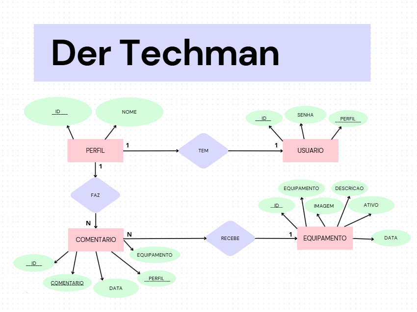
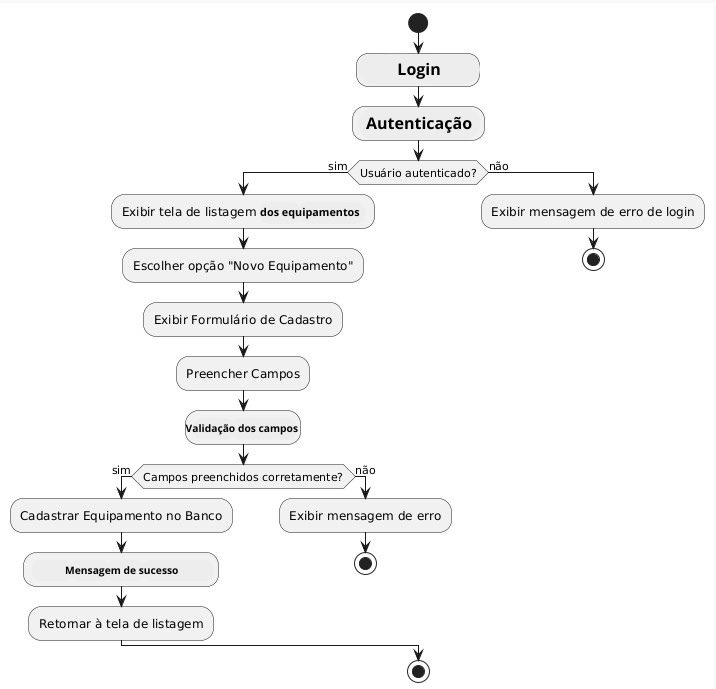

# Tecnologias
- JavaScript
- Prisma
- Mysql
- csv
- Node.js
- Express

## Passos para rodar o projeto localmente
- CLone o repositório
- De start no SGBD MySQL
- Acesse /api e instale as dependencias
```bash
npm i 
```
- Crie um arquivo .env com o conteúdo a seguir:
```bash
DATABASE_URL="mysql://root@localhost:3306/techman" 
```
- De start no mysql e rode o comando para criar as tabelas no banco de dados.
```bash
npx prisma migrate dev --name init
```
- Rode o comando para iniciar o servidor em modo de desenvolvimento.
```bash
npx nodemon server.js 
```

print dos diagramas




